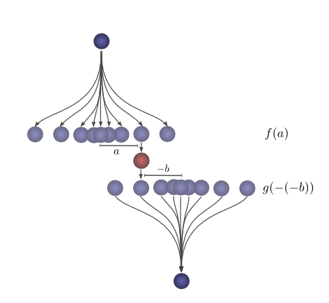
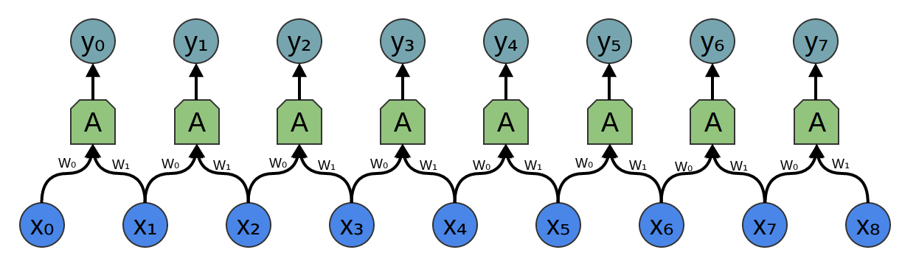

In a [previous post](../2014-07-Conv-Nets-Modular/), we built up an understanding of convolutional neural networks, without referring to any significant mathematics. To go further, however, we need to understand convolutions.

If we just wanted to understand convolutional neural networks, it might suffice to roughly understand convolutions. But the aim of this series is to bring us to the frontier of convolutional neural networks and explore new options. To do that, we're going to need to understand convolutions very deeply.

Thankfully, with a few examples, convolution becomes quite a straightforward idea.

Lessons from a Dropped Ball
============================

Imagine we drop a ball from some height onto the ground, where it only has one dimension of motion. *How likely is it that a ball will go a distance $c$ if you drop it and then drop it again from above the point at which it landed?*

Let's break this down. After the first drop, it will land $a$ units away from the starting point with probability $f(a)$, where $f$ is the probability distribution.

Now after this first drop, we pick the ball up and drop it from another height above the point where it first landed. The probability of the ball rolling $b$ units away from the new starting point is $g(b)$, where $g$ may be a different probability distribution if it's dropped from a different height.

If we fix the result of the first drop so we know the ball went distance $a$, for the ball to go a total distance $c$, the distance traveled in the second drop is also fixed at $b$, where $a+b=c$. So the probability of this happening is simply $f(a) \cdot g(b)$.[^expl]

[^expl]:
    We want the probability of the ball rolling $a$ units the first time and also rolling $b$ units the second time. The distributions $P(A) = f(a)$ and $P(b) = g(b)$ are independent, with both distributions centered at 0. So $P(a,b) = P(a) * P(b) = f(a) \cdot g(b)$.

Let's think about this with a specific discrete example. We want the total distance $c$ to be 3. If the first time it rolls, $a=2$, the second time it must roll $b=1$ in order to reach our total distance $a+b=3$. The probability of this is $f(2) \cdot g(1)$. 

However, this isn't the only way we could get to a total distance of 3. The ball could roll 1 units the first time, and 2 the second. Or 0 units the first time and all 3 the second. It could go any $a$ and $b$, as long as they add to 3.

The probabilities are $f(1) \cdot g(2)$ and $f(0) \cdot g(3)$, respectively.

In order to find the *total likelihood* of the ball reaching a total distance of $c$, we can't consider only one possible way of reaching $c$. Instead, we consider *all the possible ways* of partitioning $c$ into two drops $a$ and $b$ and sum over the *probability of each way*. 

$$...~~ f(0)\!\cdot\! g(3) ~+~ f(1)\!\cdot\! g(2) ~+~ f(2)\!\cdot\! g(1)~~...$$

We already know that the probability for each case of $a+b=c$ is simply $f(a) \cdot g(b)$. So, summing over every solution to $a+b=c$, we can denote the total likelihood as:

$$\sum_{a+b=c} f(a) \cdot g(b)$$

Turns out, we're doing a convolution! In particular, the convolution of $f$ and $g$, evluated at $c$ is defined:

$$(f\ast g)(c) = \sum_{a+b=c} f(a) \cdot g(b)~~~~$$

If we substitute $b = c-a$, we get:

$$(f\ast g)(c) = \sum_a f(a) \cdot g(c-a)$$

This is the standard definition[^AltDefBenefits] of convolution.

[^AltDefBenefits]:
    The non-standard definition, which I haven't previously seen, seems to have a lot of benefits. In future posts, we will find this definition very helpful because it lends itself to generalization to new algebraic structures. But it also has the advantage that it makes a lot of algebraic properties of convolutions really obvious.

    For example, convolution is a commutative operation. That is, $f\ast g = g\ast f$. Why?

    $$\sum_{a+b=c} f(a) \cdot g(b) ~~=~  \sum_{b+a=c} g(b) \cdot f(a)$$

    Convolution is also associative. That is, $(f\ast g)\ast h = f\ast (g\ast h)$. Why?

    $$\sum_{(a+b)+c=d} (f(a) \cdot g(b)) \cdot h(c) ~~=~ \sum_{a+(b+c)=d} f(a) \cdot (g(b) \cdot h(c))$$

To make this a bit more concrete, we can think about this in terms of positions the ball might land. After the first drop, it will land at an intermediate position $a$ with probability $f(a)$. If it lands at $a$, it has probability $g(c-a)$ of landing at a position $c$.

To get the convolution, we consider all intermediate positions.

Visualizing Convolutions
=========================

There's a very nice trick that helps one think about convolutions more easily.

First, an observation. Suppose the probability that a ball lands a certain distance $x$ from where it started is $f(x)$. Then, afterwards, the probability given that it started a distance $x$ from where it landed is $f(-x)$.

If we know the ball lands at a position $c$ after the second drop, what is the probability that the previous position was $a$?

So the probability that the previous position was $a$ is $g(-(a-c)) = g(c-a)$.

Now, consider the probability each intermediate position contributes to the ball finally landing at $c$. We know the probability of the first drop putting the ball into the intermediate position a is $f(a)$. We also know that the probability of it having been in $a$, if it lands at $c$ is $g(c-a)$.

Summing over the $a$s, we get the convolution.

The advantage of this approach is that it allows us to visualize the evaluation of a convolution at a value $c$ in a single picture. By shifting the bottom half shifting around, we can evaluate the convolution at other values of $c$. This allows us to understand the convolution as a whole.

For example, we can see that it peaks when the distributions align.

And shrinks as the intersection between the distributions gets smaller.

By using this trick in an animation, it really becomes possible to visually understand convolutions.

Below, we're able to visualize the convolution of two box functions:

From Wikipedia

Armed with this perspective, a lot of things become more intuitive.

Let's consider a non-probabilistic example. Convolutions are sometimes used in audio manipulation. For example, one might use a function with two spikes in it, but zero everywhere else, to create an echo. As our double-spiked function slides, one spike hits a point in time first, adding that signal to the output sound, and later, another spike follows, adding a second, delayed copy.

Higher Dimensional Convolutions
=================================

Convolutions are an extremely general idea. We can also use them in a higher number of dimensions.

Let's consider our example of a falling ball again. Now, as it falls, it's position shifts not only in one dimension, but in two.

Convolution is the same as before:

$$(f\ast g)(c) = \sum_{a+b=c} f(a) \cdot g(b)$$

Except, now $a$, $b$ and $c$ are vectors. To be more explicit,

$$(f\ast g)(c_1, c_2) = \sum_{\begin{array}{c}a_1+b_1=c_1\\a_2+b_2=c_2\end{array}} f(a_1,a_2) \cdot g(b_1,b_2)$$

Or in the standard definition:

$$(f\ast g)(c_1, c_2) = \sum_{a_1, a_2} f(a_1, a_2) \cdot g(c_1-a_1,~ c_2-a_2)$$

Just like one-dimensional convolutions, we can think of a two-dimensional convolution as sliding one function on top of another, multiplying and adding.

One common application of this is image processing. We can think of images as two-dimensional functions. Many important image transformations are convolutions where you convolve the image function with a very small, local function called a "kernel."

From the [River Trail documentation](http://rivertrail.github.io/RiverTrail/tutorial/)

The kernel slides to every position of the image and computes a new pixel as a weighted sum of the pixels it floats over.

For example, by averaging a 3x3 box of pixels, we can blur an image. To do this, our kernel takes the value $1/9$ on each pixel in the box, 

Derived from the [Gimp documentation](http://docs.gimp.org/en/plug-in-convmatrix.html)

We can also detect edges by taking the values $-1$ and $1$ on two adjacent pixels, and zero everywhere else. That is, we subtract two adjacent pixels. When side by side pixels are similar, this is gives us approximately zero. On edges, however, adjacent pixels are very different in the direction perpendicular to the edge.

Derived from the [Gimp documentation](http://docs.gimp.org/en/plug-in-convmatrix.html)

The gimp documentation has [many other examples](http://docs.gimp.org/en/plug-in-convmatrix.html).

Convolutional Neural Networks
=============================

So, how does convolution relate to convolutional neural networks?

Consider a 1-dimensional convolutional layer with inputs $\{x_n\}$ and outputs $\{y_n\}$, like we discussed in the [previous post](../2014-07-Conv-Nets-Modular/):

As we observed, we can describe the outputs in terms of the inputs:

$$y_n = A(x_{n}, x_{n+1}, ...)$$

Generally, $A$ would be multiple neurons. But suppose it is a single neuron for a moment.

Recall that a typical neuron in a neural network is described by:

$$\sigma(w_0x_0 + w_1x_1 + w_2x_2 ~...~ + b)$$

Where $x_0$, $x_1$... are the inputs. The weights, $w_0$, $w_1$, ... describe how the neuron connects to its inputs. A negative weight means that an input inhibits the neuron from firing, while a positive weight encourages it to. The weights are the heart of the neuron, controlling its behavior.[^bias] Saying that multiple neurons are identical is the same thing as saying that the weights are the same.

It's this wiring of neurons, describing all the weights and which ones are identical, that convolution will handle for us.

[^bias]:
  There's also the bias, which is the "threshold" for whether the neuron fires, but it's much simpler and I don't want to clutter this section talking about it.

Typically, we describe all the neurons in a layers at once, rather than individually. The trick is to have a weight matrix, $W$:

$$y = \sigma(Wx + b)$$

For example, we get:

$$y_0 = \sigma(W_{0,0}x_0 + W_{0,1}x_1 + W_{0,2}x_2 ...)$$

$$y_1 = \sigma(W_{1,0}x_0 + W_{1,1}x_1 + W_{1,2}x_2 ...)$$

Each row of the matrix describes the weights connect a neuron to its inputs.

Returning to the convolutional layer, though, because there are multiple copies of the same neuron, many weights appear in multiple positions.

Which corresponds to the equations:

$$y_0 = \sigma(W_0x_0 + W_1x_1 -b)$$

$$y_1 = \sigma(W_0x_1 + W_1x_2 -b)$$

So while, normally, a weight matrix connects every input to every neuron with different weights:

$$W = \left[\begin{array}{ccccc} 
W_{0,0} & W_{0,1} & W_{0,2} & W_{0,3} & ...\\
W_{1,0} & W_{1,1} & W_{1,2} & W_{1,3} & ...\\
W_{2,0} & W_{2,1} & W_{2,2} & W_{2,3} & ...\\
W_{3,0} & W_{3,1} & W_{3,2} & W_{3,3} & ...\\
...     &   ...   &   ...   &  ...    & ...\\
\end{array}\right]$$

The matrix for a convolutional layer like the one above looks quite different. The same weights appear in a bunch of positions. And because neurons don't connect to many possible inputs, there's lots of zeros.

$$W = \left[\begin{array}{ccccc} 
w_0 & w_1 &  0  &  0  & ...\\
 0  & w_0 & w_1 &  0  & ...\\
 0  &  0  & w_0 & w_1 & ...\\
 0  &  0  &  0  & w_0 & ...\\
... & ... & ... & ... & ...\\
\end{array}\right]$$

Multiplying by the above matrix is the same thing as convolving with $[...0, w_1, w_0, 0...]$. The function sliding to different positions corresponds to having neurons at those positions.

What about two-dimensional convolutional layers?

The wiring of a two dimensional convolutional layer corresponds to a two-dimensional convolution.

Consider our example of using a convolution to detect edges in an image, above, by sliding a kernel around and applying it to every patch. Just like this, a convolutional layer will apply a neuron to every patch of the image.

Conclusion
===========

We introduced a lot of mathematical machinery in this blog post, but it may not be obvious what we gained. Convolution is obviously a useful tool in probability theory and computer graphics, but what do we gain from phrasing convolutional neural networks in terms of convolutions?

The first advantage is that we have some very powerful language for describing the wiring of networks. The examples we've dealt with so far haven't been complicated enough for this benefit to become clear, but convolutions will allow us to get rid of huge amounts of unpleasant book-keeping for us.

Secondly, convolutions come with significant implementational advantages. Many libraries provide highly efficient convolution routines. Further, while convolution naively appears to be an $O(n^2)$ operation, using some rather deep mathematical insights, it is possible to create a $O(n\log(n))$ implementation. We will discuss this in much greater detail in a future post.

In fact, he use of highly-efficient parallel convolution implementations on GPUs has been essential to recent progress in computer vision.

Next Posts in this Series
==========================

This post is part of a series on convolutional neural networks and their generalizations. The first two posts will be review for those familiar with deep learning, while later ones should be of interest to everyone. To get updates, subscribe to my [RSS feed](../../rss.xml)!

Please comment below or on the side. Pull requests can be made on [github](https://github.com/colah/Conv-Nets-Series).

Acknowledgments
================

I'm extremely grateful to Eliana Lorch, for extensive discussion of convolutions and help writing this post.

I'm also grateful to Michael Nielsen and Dario Amodei for their comments and support.

